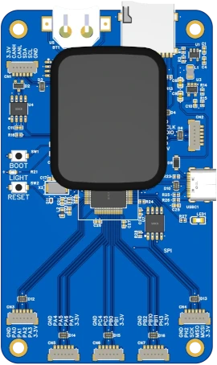

# at32f435-board

[](https://raw.githubusercontent.com/koendv/at32f435-board/refs/heads/main/doc/at32f435-board/picture.webp)

This git is the firmware for an arm  development board. The [hardware project](https://oshwlab.com/koendv/at32f435-board) is at oshwlab.

## goal

A small handheld device, with enough resources for projects.

## hardware

- Artery (雅特力) [AT32F435RGT7](https://www.arterychip.com/en/product/AT32F435.jsp), 1024 kbyte flash, 512 kbyte ram, 288 MHz.
- choice between 384kbyte ram and 256kbyte zero wait state flash, or 512kbyte ram and 128kbyte zero wait state flash.
- 280x240 LCD display with capacitive touch
- ambient light sensor to set LCD brightness
- SD card.
- 16 MByte external SPI flash.
- EEPROM for storing settings.
- battery backup for the real-time clock.
- One full-speed USB, 12 MBit/s.
- CAN bus, 1 Mbit/s.
- JST connectors for GPIO, I2C, SPI and CAN.

There is space between the processor in the middle and the connectors at the bottom. This is where you can add electronics for a project.

The cable for the connectors is a "JST SH 1.0mm to Dupont".

[easyeda](https://easyeda.com/) was used to draw the schematic and the pcb. [jlcpcb](https://jlcpcb.com/) assembled the board and 3D-printed the enclosure.

## display

The capacitive touch screen is from a smartwatch, and uses [LVGL](https://lvgl.io/) graphics. The gesture decoding is done in the touch screen itself. The interface is limited to clicks and swipes, but has the advantage of being very light on the cpu. A click or swipe is only a single interrupt. There is no touchscreen polling, no gesture decoding in software.

## compiling

Notes about [compiling the firmware](COMPILING.md).

## ordering

Notes about [ordering assembled pcb's](ORDERING.md) and 3d-printed enclosure from jlcpcb.

## running

When the board boots, console output is on the serial port. If the board is connected to usb, the console then switches to the usb serial.

Console output begins on the UART1 serial port:
```
 \ | /
- RT -     Thread Operating System
 / | \     5.2.0 build Nov  5 2024 07:00:04
 2006 - 2024 Copyright by RT-Thread team
[I/EEPROM] AT24C256 eeprom ok
[I/CAN] can1 canbus init ok
[I/MOUNT] rom mount on '/' ok
[I/SFUD] Found a Winbond flash chip. Size is 16777216 bytes.
[I/SFUD] norflash0 flash device initialized successfully.
[I/SFUD] Probe SPI flash norflash0 by SPI device spi20 success.
[D/FAL] (fal_flash_init:47) Flash device |                norflash0 | addr: 0x00000000 | len: 0x01000000 | blk_size: 0x00001000 |
initialized finish.
[I/FAL] ==================== FAL partition table ====================
[I/FAL] | name       | flash_dev |   offset   |    length  |
[I/FAL] -------------------------------------------------------------
[I/FAL] | filesystem | norflash0 | 0x00000000 | 0x01000000 |
[I/FAL] =============================================================
[I/FAL] RT-Thread Flash Abstraction Layer initialize success.
[I/FAL] The FAL block device (filesystem) created successfully
[I/MOUNT] spi flash mount on /flash ok
boot
msh />[I/LVGL] [Info]   (0.000, +0)      lv_init: begin lv_init.c:139
```
Console output then continues on the usb serial, and the shell prompt appears:
```
msh />free
total    : 498736
used     : 86672
maximum  : 92184
available: 412064
msh />
```
Insert an sd card:
```
[I/SDCARD] sd card inserted
[I/SDIO] SD card capacity 7761920 KB.
[I/SDIO] sd: switch to High Speed / SDR25 mode
[D/SDIO] probe mmcsd block device!
found part[0], begin: 0, size: 7.411GB
[I/SDCARD] sd card inserted, mounted
```
Start micropython:
```
msh />python
MicroPython v1.13-148-ged7ddd4 on 2020-11-03; Universal python platform with RT-Thread
Type "help()" for more information.
>>>
```
With rt-thread, lvgl and micropython the 1 MByte flash of a AT32F435RGT7 is full. The 4MByte flash of a AT32F435RMT7 still has room.

## changelog
[Changelog](CHANGELOG.md) where I keep track of progress.

## links

- [P169H002](https://aliexpress.com/wholesale?SearchText=P169H002&sortType=total_tranpro_desc) capacitive touch screen
- [easyeda](https://easyeda.com/) and [lceda](https://lceda.cn/) CAD software
- [LCSC](https://www.lcsc.com/) and [SZLCSC](https://www.szlcsc.com/) electronics components
- [jlcdfm](https://jlcdfm.com/) design for manufacturing
- [jlcpcb](https://jlcpcb.com/) pcb assembly and 3D printing
- [oshwlab](https://oshwlab.com) and [oshwhub](https://oshwhub.com/) open hardware projects
